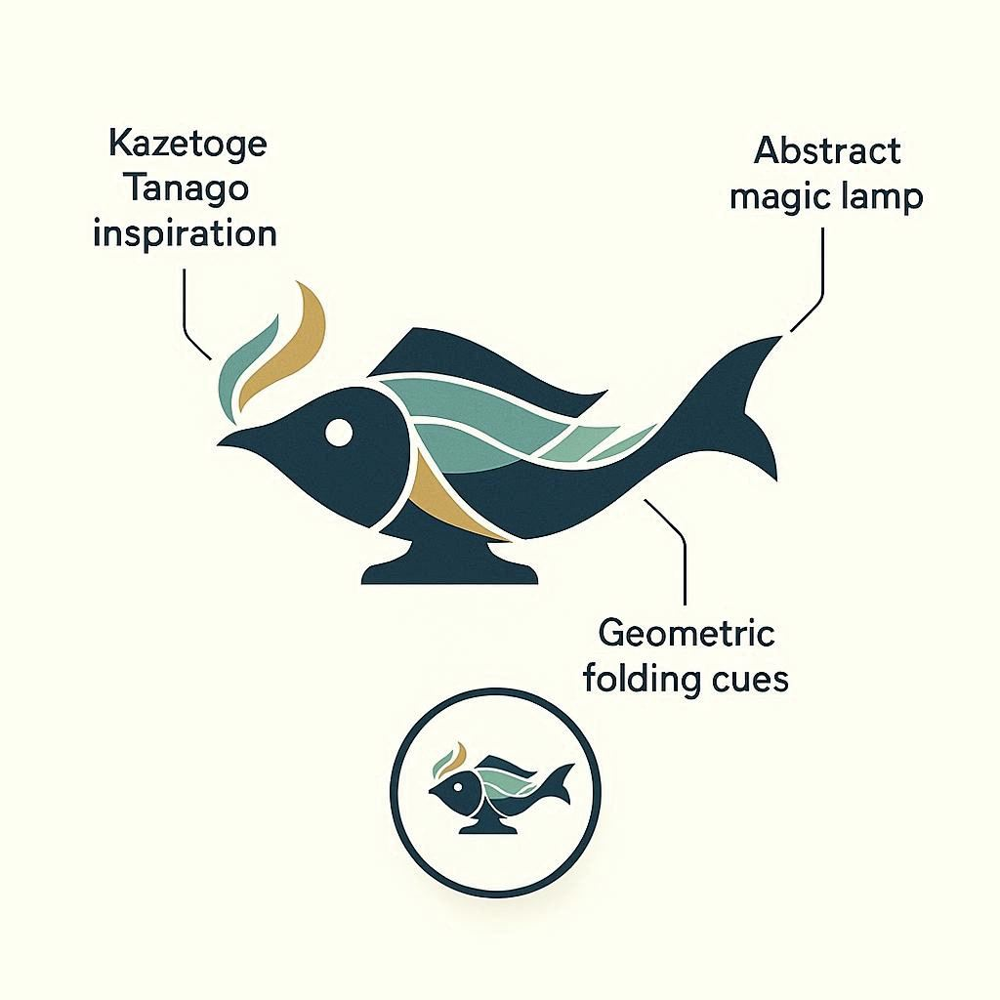

## Hi there 👋

Established in 06/06/2026

## Concepts

[カゼトゲタナゴ](https://en.wikipedia.org/wiki/Kyushu_bitterling)から着想を得たもの。当時、日本淡水魚を飼育しておりウェブで見たカゼトゲタナゴの姿と言葉の美しさにあやかってというところです。

* Kaze (Wind): 風を起こす、風に乗る、台風の目になる、停滞を吹き飛ばす 
* Toge (Achieve) : トゲ→遂げる、踏破する、困難を突き破る
* Genie: 魔人→魔法のランプ→実現する

呼称はカゼトゲーニ、カゼトジーニです。不死鳥のタマゴトジーニもいいですね。

## どこへ行こうというのかね？

活動予定はとあるソフトウェアの長期開発とアクアリウム関連の執筆くらいですね。翻訳もできますが精力的には活動しないです。

<!--
**kazetogenie/kazetogenie** is a ✨ _special_ ✨ repository because its `README.md` (this file) appears on your GitHub profile.

Here are some ideas to get you started:

- 🔭 I’m currently working on ...
- 🌱 I’m currently learning ...
- 👯 I’m looking to collaborate on ...
- 🤔 I’m looking for help with ...
- 💬 Ask me about ...
- 📫 How to reach me: ...
- 😄 Pronouns: ...
- ⚡ Fun fact: ...
-->
